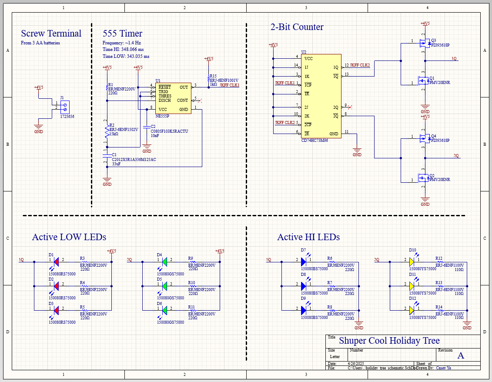
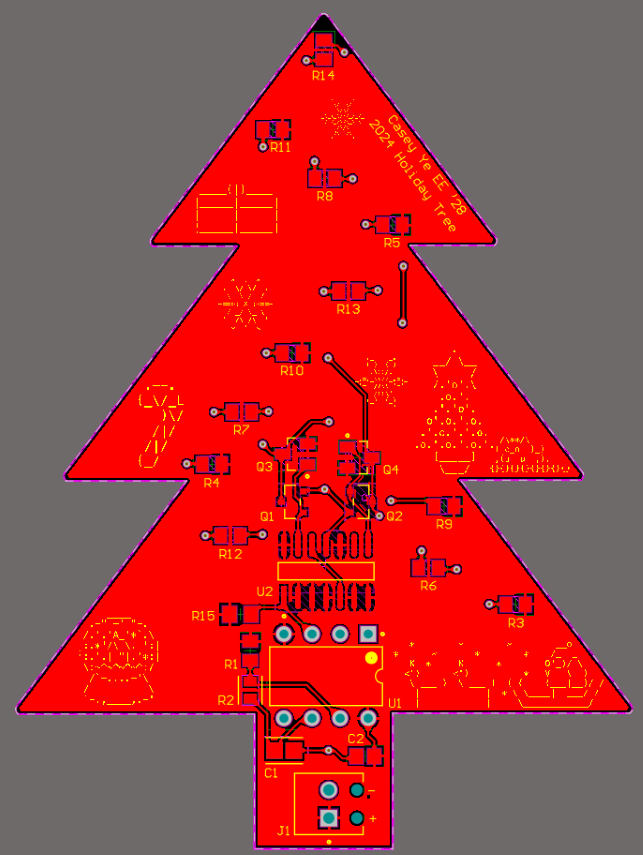
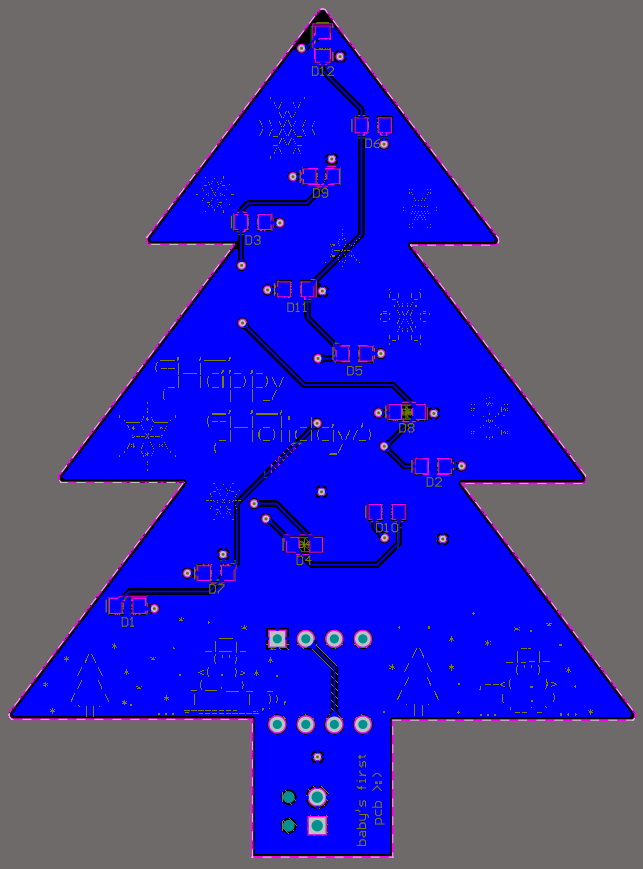
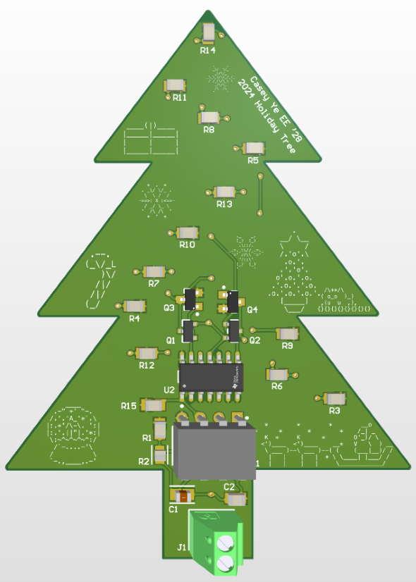
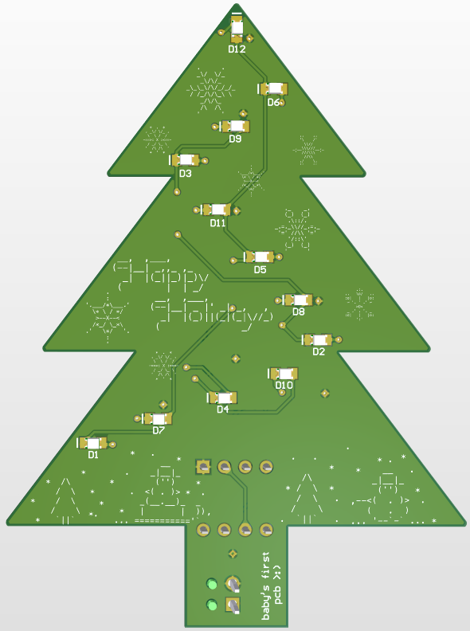

# Holiday Tree

This was the first ever PCB I've ever worked on. The holiday tree PCB was a project that was used during the 'PCB Lab' workshop, intended to introduce students to PCB design. As an operator, I made my own version of the board before helping out with the workshop. 

This tree utilizes a 555 timer and a 2-Bit Counter to switch between sets of red, green, blue, and yellow LEDs to light up a holiday tree-shaped PCB. The 2-Bit counter consists of a JK flip flop and MOSFET transistors. It was necessary that these transistors were used because one JK flip flop does not output enough current to power all the LEDs. By utilizing the transistors, the LEDs would be powered from the battery, not the JK flip flop.

## PCB files
Below is the schematic of the Holiday tree.

Below is the layout of the top layer.  

Below is the layout of the bottom layer.  

Below is the 3D model of the top layer.  

Below is the 3D model of the bottom layer.  
